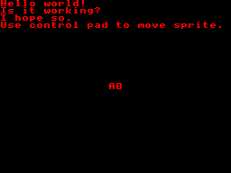

# SMSlib example for z88dk

**Platforms:** SEGA Master System, Game Gear

## What is z88dk?
z88dk is an open-source C/assembly toolchain for 8080 and Z80-family systems (including the Sega Master System and Game Gear). It includes compilers, assemblers, linkers, and platform libraries for building ROMs for many classic machines. See [z88dk.org](https://www.z88dk.org/).

## Install z88dk with Snap (Linux)

If you are using WSL, this also works in WSL environments where `snapd` is available.

Install the Snap package:

```sh
sudo snap install z88dk --edge
```

Create the recommended Snap aliases:

```sh
sudo snap alias z88dk.z88dk-appmake z88dk-appmake
sudo snap alias z88dk.z88dk-asmstyle z88dk-asmstyle
sudo snap alias z88dk.z88dk-dis z88dk-dis
sudo snap alias z88dk.z88dk-z80asm z88dk-z80asm
sudo snap alias z88dk.z88dk-zx0 z88dk-zx0
sudo snap alias z88dk.zcc zcc
```

Notes:
 - `zcc` is required for `make` / `make GG=1`.
   - `z88dk-appmake` and `z88dk-z80asm` are invoked by the z88dk build/link flow.
 - `z88dk-dis` is required for `make dis`.
 - A prebuilt Windows distribution is also available from the nightly builds: [nightly.z88dk.org](https://nightly.z88dk.org/).

## Purpose

This example demonstrates how to:
 - Compile and link code with SMSlib and z88dk for both SMS and Game Gear
 - Initialize the SMSlib subsystem (`SMS_init`, `SMS_useFirstHalfTilesforSprites`, `SMS_autoSetUpTextRenderer`, `SMS_loadBGPalette`/`GG_loadBGPalette`, `SMS_loadSpritePalette`/`GG_loadSpritePalette`)
 - Link z88dk interrupts to SMSlib ISRs (`add_raster_int(SMS_isr)`, `add_pause_int(SMS_nmi_isr)` — SMS only)
 - Display text using `printf`, `SMS_print`, and `SMS_printatXY` (positioned with `SMS_setNextTileatXY`), accounting for the GG viewport offset
 - Set up and move a sprite using the built-in charset tiles with the D-pad (`SMS_addMetaSprite`, `SMS_updateMetaSpritePosition`, `SMS_copySpritestoSAT`), clamped to the visible screen area
 - Change sprite palette colour on button 1 and button 2 press/release (`SMS_getKeysStatus`, `SMS_setSpritePaletteColor`/`GG_setSpritePaletteColor`)
 - Pause and unpause the game (Pause button — SMS only), saving and restoring the tilemap (`SMS_queryPauseRequested`, `SMS_resetPauseRequest`, `SMS_saveTileMapArea`, `SMS_loadTileMapArea`)
 - Soft-reset on the Reset button — SMS only (`SMS_displayOff`, `SMS_zeroSpritePalette`, `SMS_zeroBGPalette`)

## Screenshots

Initial screen (before any controller input):



## Compilation

The included Makefile will build the library before building the application.

It is assumed that z88dk is in your path and the appropriate Snap aliases have been configured, if necessary.

### Building for SMS (default)

```sh
make
```

Produces `hello.sms`.

### Building for Game Gear

```sh
make GG=1
```

Produces `hello.gg`. This passes `-subtype=gamegear` and `-DTARGET_GG` to z88dk, selects
`zSMSlib_GG.lib`, and adjusts screen dimensions and the viewport tile/pixel offsets in the
source for the GG's 160×144 visible window.

### Make targets

| Target | Description |
|--------|-------------|
| `make` / `make all` | Build `zSMSlib.lib` (if needed) then compile and link `hello.sms` |
| `make GG=1` | Build `zSMSlib_GG.lib` (if needed) then compile and link `hello.gg` for Game Gear |
| `make dis` | Disassemble the ROM using `z88dk-dis` and the generated map file (requires `z88dk-dis` in path) |
| `make clean` | Remove local build artifacts (`*.o`, `*.bin`, `*.sms`, `*.gg`, `*.map`) |
| `make distclean` | Like `clean`, but also removes the built SMSlib libraries and their object files |
